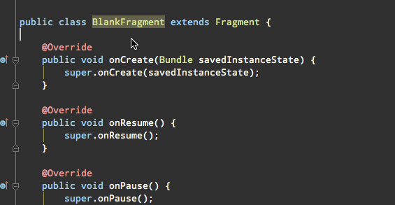

# Fragment newInstance Inspection

[](https://gitter.im/shiraji/new-instance-inspection?utm_source=badge&utm_medium=badge&utm_campaign=pr-badge&utm_content=badge) [](http://android-arsenal.com/details/1/2348)

This plugin add an inspection that check if Fragment implements following method. (if the class is MyFramgment)

```MyFramgment.java
public static MyFragment newInstance() {
    MyFragment fragment = new MyFragment();
    return fragment;
}
```



## Settings

To change settings, go to `Preferences > Editor > Inspections > Android > Fragment should implement newInstance()`

### Method name

The method name `newInstance` is configurable.

## Installation

Use the IDE's plugin manager to install the latest version of the plugin.

or

[Download](https://github.com/shiraji/new-instance-inspection/blob/master/new-instance-inspection.jar?raw=true) jar file and then go to Preferences > Plugins > Install plugin from disk... > Select the jar file you downloaded

## Contributing

1. Fork it!
2. Create your feature branch: `git checkout -b my-new-feature`
3. Make sure you put gradle.jar to 'IntelliJ Plugin SDK'. `File > Project Structure... > SDKs > IntelliJ Plugin SDK > click + sign > Pick gradle.jar file from under IntelliJ IDEA's plugin directory`
4. Commit your changes: `git commit -am 'Add some feature'`
5. Push to the branch: `git push origin my-new-feature`
6. Submit a pull request

## License

```
Copyright 2015 Yoshinori Isogai

Licensed under the Apache License, Version 2.0 (the "License");
you may not use this file except in compliance with the License.
You may obtain a copy of the License at

   http://www.apache.org/licenses/LICENSE-2.0

Unless required by applicable law or agreed to in writing, software
distributed under the License is distributed on an "AS IS" BASIS,
WITHOUT WARRANTIES OR CONDITIONS OF ANY KIND, either express or implied.
See the License for the specific language governing permissions and
limitations under the License.
```
